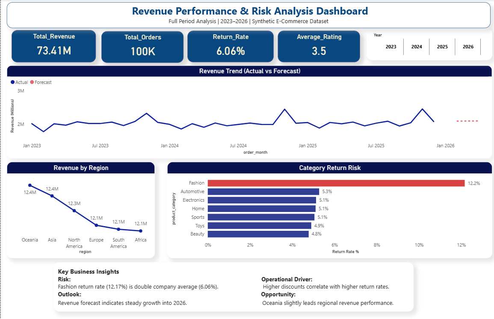

# 📊 E-Commerce Revenue & Demand Intelligence System

End-to-end analytics project analyzing a synthetic e-commerce dataset (2023–2026) using SQL, Python, and Power BI.

This project simulates a real-world BI workflow , from database modeling to executive dashboard reporting.

---

## 🔎 What This Project Covers

- Revenue performance & forecasting
- Return risk analysis
- Customer lifetime value segmentation
- Category-level demand trends
- Discount vs return correlation

## 🏗️ Architecture

Raw Dataset  
→ MySQL Database  
→ SQL Analytical Views  
→ Python (EDA & Validation)  
→ Power BI Dashboards 

## 🛠 Tech Stack

- **SQL (MySQL)** – Data modeling & analytical views  
- **Python (Pandas, SQLAlchemy)** – Data validation & exploration  
- **Power BI** – Dashboard development  
- **DAX** – Measures & time intelligence  
- **Star Schema Modeling**  
- **Git & GitHub**

---

## 📈 Dashboard Highlights

### 1️⃣ Revenue & Risk Analysis
- 73.4M Total Revenue | 100K Orders
- 6.06% Return Rate
- Fashion category shows 2× higher return risk
- Revenue trending upward into 2026

### 2️⃣ Customer & Category Intelligence
- Top customers by lifetime value
- Customer segmentation (Low / Medium / High)
- Revenue contribution by category
- Discount vs return rate correlation

# 📈 Page 1 — Revenue Performance & Risk Analysis

## 🖼 Dashboard Preview

### Key Metrics
- Total Revenue: **73.4M**
- Total Orders: **100K**
- Return Rate: **6.06%**
- Average Rating: **3.5**

### Key Insights
- Fashion return rate (12.17%) is nearly 2× the company average.
- Higher discounts correlate with increased return rates.
- Revenue trend indicates steady growth into 2026.
- Oceania leads regional revenue performance.

### Business Value
- Monitor revenue vs forecast
- Identify high-risk product categories
- Support pricing & discount optimization decisions

---

# 📊 Page 2 — Customer & Category Intelligence

## 🖼 Dashboard Preview

### Key Analysis Areas
- Top 10 customers by lifetime value
- Customer value segmentation (Low / Medium / High)
- Revenue contribution by category
- Monthly revenue trend by category
- Discount vs Return Risk (Correlation Analysis)

### Insights
- A small percentage of customers generate disproportionate revenue.
- Revenue contribution remains diversified across product categories.
- Category-level seasonal demand patterns are visible.

### Business Value
- Customer segmentation strategy
- Demand planning visibility
- Return risk monitoring
- Category performance optimization

---

## 🧠 Skills Demonstrated

- End-to-end analytics pipeline design 
- Star schema data modeling 
- SQL view creation & optimization 
- DAX measure development 
- Forecasting & correlation analysis 
- Executive dashboard storytelling 

---

**Author:** Anushka Shelke  
Data Analyst | SQL | Power BI | Python

⭐ If you found this project insightful, feel free to explore the dashboards and SQL scripts in this repository.
